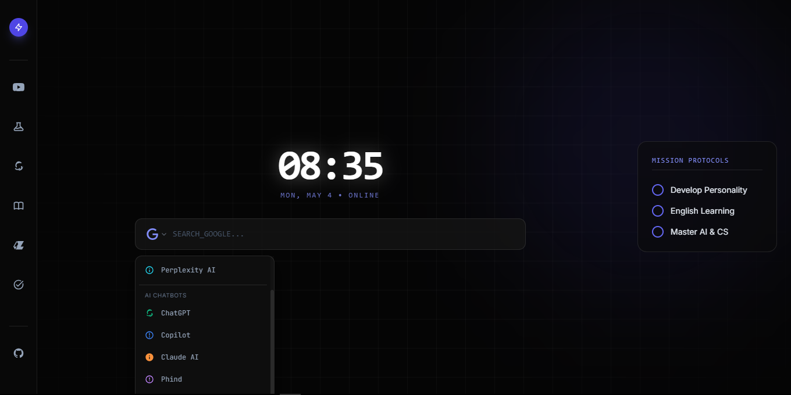

# 🌐 Chrome Homepages

Welcome to the **Chrome Homepages**! This project is a collection of custom-designed homepages created to replace the default browser 'New Tab' page. Each design focuses on different needs—be it productivity, minimalism, or aesthetics.

## 🚀 Concept
Instead of a cluttered default page, this repository provides simple, lightweight HTML files that you can set as your browser's starting page. 

## ✨ Features (Planned & Current)
*   **Multiple Themes:** Different designs ranging from Dark Mode to Nature-inspired.
*   **Useful Widgets:** Digital clocks, motivational quotes, and quick-link icons.
*   **Lightweight:** Built with pure HTML/CSS, so it loads instantly.
*   **Customizable:** Easy to edit the code to add your own favorite bookmarks.

## 🛠️ Tech Stack
*   **HTML5**
*   **CSS3** (Custom styling)
*   **JavaScript** (For time and dynamic features)

## 📸 Screenshots
** 
> **✨ Live Demo:** [Click here to view the homepage](https://fhraj-0.github.io/chrome_homepages/)
## ⚙️ How to Use
1.  **Clone the Repo:** 
    `git clone https://github.com/your-username/chrome_homepage.git`
2.  **Open File:** Find the `.html` file of the design you like.
3.  **Set as Homepage:**
    *   In Chrome, go to **Settings** > **On Startup** > **Open a specific page or set of pages**.
    *   Add the local path of your favorite HTML file.
    *   *Tip:* You can also use extensions like "Custom New Tab" to point to these files.

---
*Created with ❤️ and a little help from AI to make browsing better.*
